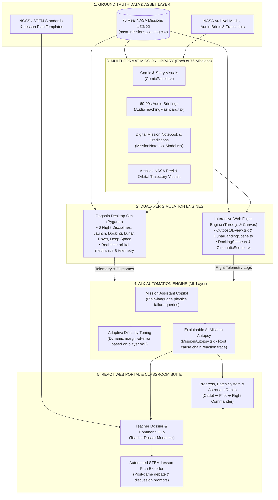

# Jr_AstroCamp: Platform Architecture & Product Roadmap
**NASA Space Apps Challenge 2026**

---

## 1. Executive Summary
In a universe where the next generation of astronauts is sitting in classrooms right now, **Jr_AstroCamp** is Team Mysterio's answer to a question every space agency eventually asks: *how do you turn a curious kid into a mission-ready thinker?* 

Powered by real NASA mission data, Jr_AstroCamp is far more than another space-facts app. While most STEM platforms either oversimplify the science or bury it in jargon, Jr_AstroCamp tackles the real challenge: letting students run real missions, feel the weight of every engineering trade-off, and learn the way that actually works for them. Built for the 2026 NASA Space Apps Challenge under the **"Build a Junior Astronaut Mission Trainer"** challenge, Jr_AstroCamp fuses an interactive outpost-management game and 76-mission 60 FPS flight simulator with a full multi-format learning library into a single platform designed for young explorers.

---

## 2. System Architecture Diagram

---

## 3. Product Roadmap

### **Phase 1: Hackathon Submission MVP (Current — Production-Ready)**
* **Objective:** Deliver a working end-to-end learning loop: Briefing $\rightarrow$ Multi-format Study $\rightarrow$ Flight Simulation $\rightarrow$ Explainable AI Debrief.
* **Core Deliverables:**
  - **76 Real NASA Missions Catalog:** Sourced from Mercury, Gemini, Apollo, Skylab, Shuttle, Artemis, Mars Exploration, and Lagrange Deep Space Observatories (`nasa_missions_catalog.csv`).
  - **Desktop Simulator Flagship:** Full Pygame physics engine with 6 disciplines (`nasa_game/`, `main.py`).
  - **Web Portal Companion:** React 19 + TypeScript + Three.js application with 3D habitats, interactive landing, and docking mini-simulators (`src/`).
  - **Multi-Format Content Bundles:**
    - Visual Story Cards (`ComicPanel.tsx`).
    - Audio Briefings with Procedural Radio Synthesizer (`AudioTeachingFlashcard.tsx`).
    - Field Log Prediction Worksheet (`MissionNotebookModal.tsx`).
  - **Explainable AI Debrief (AIB):** Root-cause causal chains showing how earlier operational trade-offs cascaded into victory or failure (`MissionAutopsy.tsx`).
  - **Teacher & Parent Dossier:** Curriculum alignment and classroom discussion starters (`TeacherDossierModal.tsx`).

### **Phase 2: Classroom Beta Pilot (Months 1 – 3 Post-Hackathon)**
* **Objective:** Enable teachers to assign mission sets and track whole-class engagement.
* **Key Features:**
  - **Teacher Command Dashboard:** Student roster authentication, mission set assignments (e.g., *"Apollo 11 vs. Artemis II flight comparison"*).
  - **Classroom Telemetry Aggregation:** Pinpointing common failure bottlenecks (e.g., "70% of students ran out of RCS fuel during approach").
  - **AI Mission Assistant Copilot:** Plain-language conversational assistant grounded in NASA historical flight transcripts and basic physics manuals.
  - **Exportable PDF Field Certificates:** Printable mission completion dossiers and student flight records.

### **Phase 3: District & Global Scale (Months 4 – 12)**
* **Objective:** Turn Jr_AstroCamp into an adopted STEM standard for schools and science centers worldwide.
* **Key Features:**
  - **LMS Integration:** Google Classroom, Canvas, and Clever Single Sign-On (SSO) with auto-grading for completed mission notebooks.
  - **WebAssembly (WASM) Full Sim Port:** Run the heavy desktop simulation core directly on Chromebooks without local software installation.
  - **Classroom Co-Op Flight Control:** Dual-student multiplayer where one student commands the cockpit and another runs Mission Control telemetry.
  - **Community Mission Builder:** Drag-and-drop tool allowing educators to craft custom space missions based on emerging space discoveries.

---

## 4. Team Competencies & Codebase Anchors

| Team Strength | Platform Responsibility | Project File Anchors |
| :--- | :--- | :--- |
| **Data & Grounding** | 76 historical missions, real trajectory bounds, telemetry logs | `nasa_missions_catalog.csv`, `src/data/nasaMissions.ts` |
| **ML & AI** | Root-cause causal chain analysis, failure attribution, adaptive difficulty | `src/components/MissionAutopsy.tsx`, `AIDisclosureModal.tsx` |
| **Full-Stack & Games** | React portal, Three.js 3D rendering, Pygame desktop physics engine | `main.py`, `nasa_game/`, `src/App.tsx`, `src/game/` |
| **Design & Media** | Mission patches, comic panels, audio synthesizer, HUD interfaces | `src/components/ComicPanel.tsx`, `AudioTeachingFlashcard.tsx`, `Outpost3DView.tsx` |
| **Curriculum & EdTech** | NGSS learning targets, post-flight discussion guides, classroom dossiers | `src/components/TeacherDossierModal.tsx`, `MissionNotebookModal.tsx` |
