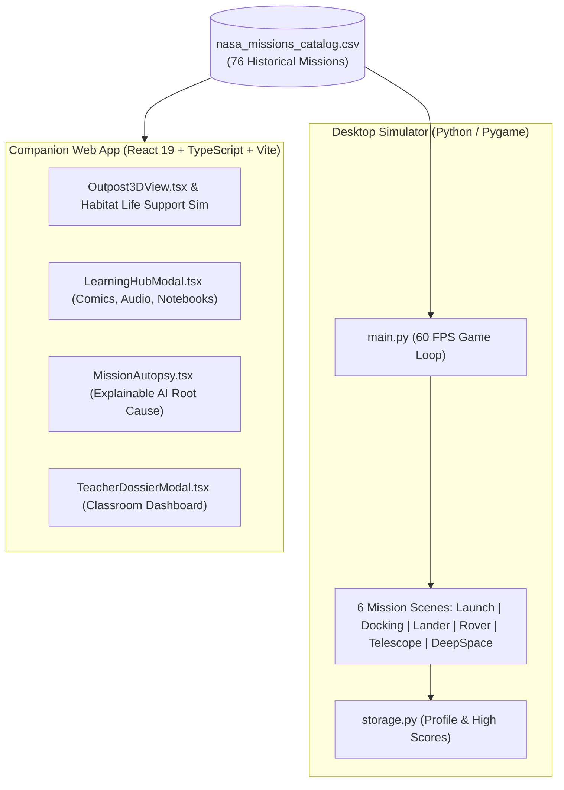

# 🚀 Jr_AstroCamp: Fly. Learn. Explore.

**NASA International Space Apps Challenge 2026**  
**Team Mysterio**

[](https://python.org)
[](https://www.pygame.org)
[](https://react.dev)
[](https://vitejs.dev)
[](https://nasa.gov)

---

## 🌟 Executive Overview & Project Description

> *"In a universe where the next generation of astronauts is sitting in classrooms right now, Jr_AstroCamp is Team Mysterio's answer to a question every space agency eventually asks: how do you turn a curious kid into a mission-ready thinker?"*

Powered by real NASA mission data, **Jr_AstroCamp** is far more than another space-facts app. While most STEM platforms either oversimplify the science into cartoons or bury it in technical jargon, Jr_AstroCamp tackles the real challenge: **letting students fly real missions, run planetary outposts, feel the weight of every engineering trade-off, and learn the way that actually works for them.**

Built for the **2026 NASA Space Apps Challenge** under the *"Build a Junior Astronaut Mission Trainer"* challenge, Jr_AstroCamp fuses a 60 FPS flight simulator and interactive outpost-management game with a comprehensive multi-format learning library into a single unified platform for young explorers.

---

## 👥 Team Mysterio

| Role | Responsibility |
| :--- | :--- |
| **🤖 AI Automation Engineer** | Data ingestion pipelines & automated catalog content delivery |
| **📊 Data Scientist** | 76 NASA mission datasets, realistic telemetry & trajectory physics |
| **🧠 ML Engineer** | Explainable AI debriefs & root-cause failure analysis |
| **💻 Full-Stack Developer** | Pygame desktop simulator & React/TypeScript companion web portal |
| **🔭 Researcher** | Historical NASA flight accuracy, telemetry grounding & STEM alignment |
| **🎨 UI/UX Designer** | Immersive space aesthetic, HUD interfaces, comic storyboards & sound design |

---

## 🎯 The Core Philosophy: "Four Doors Into Every Concept"

Traditional STEM content either oversimplifies real engineering into cartoons or drowns young learners in dense technical jargon. Worse, single-format tools leave diverse classrooms behind.

Jr_AstroCamp solves this with **Four Doors**:
1. **🎮 Play & Simulate:** Real 60 FPS flight physics across 6 mission disciplines.
2. **📖 Visual Story Comics:** Dynamic panels narrating real crew triumphs and historical challenges.
3. **🔊 Audio Lessons:** CapCom radio briefings and synthesized audio logs for listening anywhere.
4. **📓 Handwritten Notebooks:** Digital mission journals for students who learn through writing and hypothesis logging.

---

## 🕹️ The Flight Simulator Engine

Powered by Python and Pygame running at 60 FPS, the simulator hosts **76 data-driven historical NASA missions** spanning Mercury, Gemini, Apollo, Skylab, the Space Shuttle, Artemis, Mars Rovers, and Deep Space Observatories.

### **6 Playable Mission Disciplines:**
1. **🚀 Launch:** Manage thrust profile, atmospheric drag, staging, and orbital insertion trajectory.
2. **🛰️ Docking:** Align relative velocities, attitude angles, and RCS thrusters to dock with orbital stations.
3. **🌕 Lander:** Control descent rate, gravity acceleration, and touchdown attitude with tight fuel margins.
4. **🚗 Rover:** Traverse rough planetary terrain, dodge craters, and sample scientific hotspots.
5. **🔭 Telescope:** Acquire, guide, and lock optical instruments onto deep-space cosmic targets.
6. **🌌 Deep Space:** Calculate gravitational slingshots and course corrections across interplanetary distances.

---

## 💻 Tech Stack & Architecture



---

## 🚀 Quick Start Guide

### 1. Launching the Pygame Flight Simulator (Desktop)
```bash
# Set up Python virtual environment
python3 -m venv .venv
source .venv/bin/activate

# Install requirements
pip install pygame

# Run the game
python3 main.py
# Or use the runner script:
./run_game.sh
```

### 2. Launching the React Companion Web App
```bash
# Install Node dependencies
npm install

# Start development server
npm run dev
```
Open [http://localhost:5173](http://localhost:5173) in your browser.

---

## 🗺️ Product Roadmap

- [x] **Phase 1: Hackathon Submission MVP (Ready)**
  - 76-mission catalog loader (`nasa_missions_catalog.csv`)
  - 6 flight disciplines in Python/Pygame & React/Phaser
  - Multi-format Learning Hub (Comics, Audio, Digital Notebooks)
  - Explainable AI Mission Autopsy (`MissionAutopsy.tsx`)
  - Persistent save profiles (`saves/profile.json`)
- [ ] **Phase 2: Classroom Beta Pilot**
  - AI Mission Assistant ("Why did I fail?") grounded in NASA flight telemetry
  - Teacher Command Dashboard with roster assignment & class telemetry
  - Adaptive Difficulty Tuning & Astronaut Patch rewards
- [ ] **Phase 3: Global Scale**
  - WebAssembly (WASM) direct browser port for Chromebooks
  - LMS Integrations (Google Classroom, Canvas)
  - Multi-language localization


> **Jr_AstroCamp · Team Mysterio**  
> *"Fly. Learn. Explore."* 🚀
